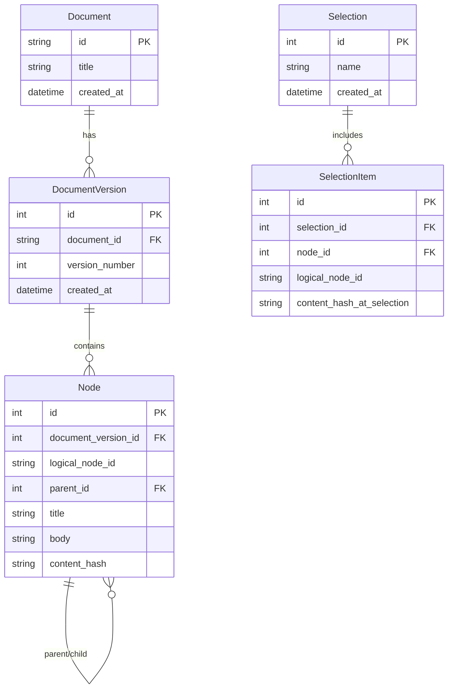

# System Approach & Architecture

## Data Model Diagram

> [!NOTE]
> The **Generation Store** operates asynchronously alongside this schema. Generations are physically decoupled into a filesystem `data/generations/{generation_id}.json` store per TRD Section 3. Staleness bridges this gap dynamically by querying the current `Node` table utilizing the JSON record's `source_snapshot` footprint.

## Tree-Parsing Decisions & Irregularities

Due to an out-of-band specification update, we pivoted to ingest native PDF files rather than standard Markdown. To accomplish this without error-prone visual OCR, we leveraged `PyMuPDF` to slice structural heading blocks strictly by font-size and weight heuristics.

During initial parsing experiments, we discovered several critical **Irregularities** that broke the standard hierarchy, which were explicitly solved and individually unit-tested:
1. **Level-Skip Normalisation**: We encountered sections like `2.1.1.1` occurring immediately underneath `2.1` with no intervening parent. The parser was originally discarding these as orphans or injecting them as siblings. We patched this by forcing level-skips to recursively mount to the highest available chronological parent.
2. **Numbered Lists Mimicking Headings**: Section 3.3 Classification contained lists that parsed identically to headings (e.g., `1. Type BF Applied Part`). We implemented structural heuristic checks to ensure inline numbered items inside text bodies were explicitly rejected as logical node partitions.
3. **Table Header Suppression**: The raw text extraction of the Error Code table parsed `Code` and `Meaning` as top-level headers, corrupting the document tree. We patched the heuristic to aggressively suppress short title blocks adjacent to known table structures.

## Version-Matching Strategy

New Document ingestion initiates our `VersioningMatcher`. The strategy employs a prioritized, cascading waterfall approach:
1. **Direct Path + Title Match**: Absolute confidence.
2. **Fuzzy Fallback**: If titles mutate slightly, we apply a `.sequenceMatcher` similarity score. If it passes `>80%`, we classify it as the identical logical node, absorbing the mutation.
3. **Duplicate Disambiguation**: When encountering repeated sibling titles (e.g., two distinct "Warnings" blocks under a parent), we anchor them securely utilizing sequential order indexing.

**Known Failure Modes**: The fuzzy match heuristic is highly effective but incredibly aggressive. A drastic rewrite of a title combined with a drastic rewrite of the body will fall beneath the 80% threshold, causing the matcher to silently classify the behavior as a total "node removal" and a subsequent "new node addition", rather than a clean update.

## LLM Prompt Design & Resiliency

Test-case generation relies on a strict loop enforcing rigid schema structure (located in `app/generation/service.py`):
- **Prompt Architecture**: Instructs the LLM via a specialized system role ("QA engineer for regulated medical devices"), injecting context directly into isolated markdown blocks.
- **Failover Strategy**: Utilizes `Pydantic` `ValidationError` structures as a real-time feedback mechanism. If the model outputs malformed JSON, the pipeline catches the failure, strips the stack trace, and recursively queries the LLM a second time, providing its own exact error so it may self-correct. Irrecoverable failures are stored as raw text dumps with `status=failed`.

---

## Decision Log

**1. What's most likely to silently give wrong results without erroring, and how would you catch it?**
The PDF text classification pipeline is highly susceptible to silent structural corruption, specifically heuristic misclassification and layout-flattening bugs. We encountered this firsthand: the parser silently deleted the `"4. Alarms and Safety Behavior"` heading because the `_is_table_header` heuristic over-aggressively matched the word "Behavior" in the 5-word title. Additionally, PyMuPDF's raw reading-order extraction flattened geometric tables (e.g., `2.1 General Specifications`) into jumbled, unassociated prose, silently destroying row/col relationships for the LLM. 

Neither of these critical bugs were caught by our initial synthetic unit tests. They were only discovered by running the parser directly against the *real physical PDF* (`scripts/dump_tree.py`) and conducting a meticulous, line-by-line manual audit against the source document. You catch these "silent heuristic failures" by mandating end-to-end visual audits on real documents, rather than relying exclusively on mocked test fixtures.

**2. Where did you choose simplicity over correctness because of time, and what breaks first in production?**
In our table extraction rewrite, we chose simplicity by synthesizing the entire detected table into a monolithic markdown block and unconditionally bypassing all heading heuristics (`b.get("type") == "table" -> "body"`). This correctly preserves table geometry for the LLM, but assumes tables will never contain structural document hierarchy. In production, if a manual features a complex, multi-page table containing actual numbered sub-headings inside its cells, our parser will break by blindly bundling the entire structure into a single, massive body chunk, destroying node granularity and bloating the LLM prompt context window during QA generation.

**3. One input you didn't handle, and what the system does when it sees it.**
We still do not handle legitimate structural headings that are typeset completely identically to body text, lacking both font-weight signals and numbering prefixes. If a PDF author formats a critical section title at 10pt, un-bolded, and without a "N." pattern, the parser will blindly swallow it into the preceding section's body text. The system requires *some* physical or numeric signal to promote a text block to a structural node; without it, the layout engine drops the hierarchy, permanently burying the section within a parent node and making it impossible for a user to target it independently for Test Case generation.

## Future Improvements (With More Time)

- **Vector-Based Semantic Search**: Transitioning from exact-string search (`GET /nodes/search`) to dense embeddings leveraging PGVector or a standalone vector store to dramatically increase search relevancy.
- **Materiality Scoring**: Replacing exact hashing staleness with an LLM evaluation pipeline capable of classifying document changes into "Critical", "Moderate", or "Cosmetic" buckets.
- **Interactive Review UI**: A frontend application dedicated solely to diff-resolution, allowing QA engineers to interactively resolve and accept the generated diffs outputted by the Staleness checks.
